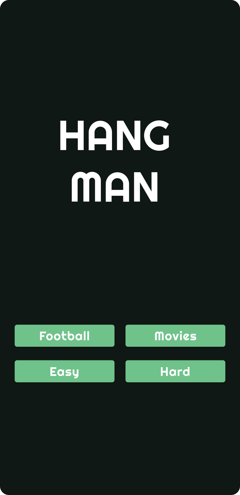
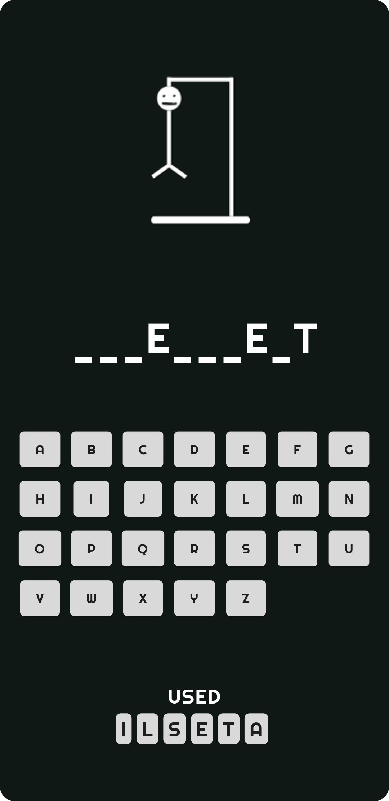

# Hangman Game - Flutter

A classic Hangman game built using Flutter for Android and iOS platforms. This project was developed as a personal project to learn Flutter and to get proficient in the basics.

<div align="center">
  
  
</div>


## Features

- Classic Hangman gameplay with a word-guessing challenge.
- 4 modes to play: Easy, Hard, Football and Movies
- A variety of words to guess, providing endless fun.
- User-friendly interface.
- Enjoyable sound effects for an immersive gaming experience.

## Getting Started

These instructions will help you get a copy of the project up and running on your local machine for development and testing purposes.

### Prerequisites

To run this project, you need to have Flutter and Dart installed on your development machine.  You will need a android system (an emulator or an android device) for windows or an ios system (iPhone emulator or an iPhone device) for mac users. You can download them from [here](https://flutter.dev/docs/get-started/install).

### Installation

1. Clone this repository to your local machine using:

   ```shell
   git clone https://github.com/amarahamed/hangman_game_flutter.git

2. Navigate to the project directory:
   ```shell
   cd hangman-flutter

3. Install the project dependencies:
    ```shell
   flutter pub get

4. Run the app on your preferred emulator or physical device:
    ```shell
   flutter run


### Gameplay

- **Launch the game on your device.**
  To get started, simply open the game on your Android or iOS device.

- **Select a mode**
  Choose a mode from the main screen. Your have 4 options. The easy mode generates 60 random words from the english_words package and the game picks one from that list for you to guess. Football, Hard and Movies are hard coded to an array and picks one from that list for you to guess.

- **Start guessing letters to complete the hidden word.**
  Use the on-screen keyboard to guess individual letters.

- **You have a limited number of incorrect guesses before the game ends.**
  Be careful! You only have a certain number of incorrect guesses available. Make each guess count.


### Built With
- [Flutter](https://flutter.dev/) - The cross-platform framework used.
- [Dart](https://dart.dev/) - The programming language used.
